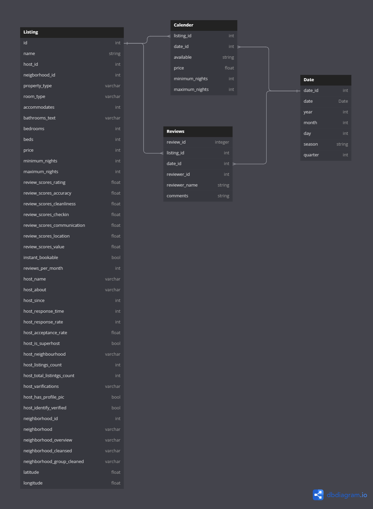

## Airbnb Data Warehouse (DWH)

### Schema Overview

The Airbnb Data Warehouse (DWH) is designed to centralize and organize Airbnb's operational data for analytical purposes. The schema consists of several tables, categorized into fact tables and dimension tables:

#### Fact Tables:

1. **calendar_Fact**: This fact table stores information about the availability and pricing of Airbnb listings on different dates. It captures details such as listing ID, date, availability status, and pricing.

2. **review_Fact**: This fact table contains data related to guest reviews of Airbnb listings. It includes information such as review ID, listing ID, review date, and various review scores.

#### Dimension Tables:

1. **date_Dim**: The date dimension table serves as a reference for date-related attributes. It contains details such as date, year, month, day, season, and quarter. This table facilitates time-based analysis and allows users to slice and dice data based on temporal aspects.

2. **listing_Dim**: The listing dimension table stores detailed information about Airbnb listings. It includes attributes such as listing ID, listing name, host details, location details, property type, and other listing-specific information. This table provides context and descriptive attributes for analyzing listings.

### Rationale for Choosing Fact and Dimension Tables

#### Fact Tables:

1. **calendar_Fact**: This table is chosen as a fact table because it represents a key aspect of Airbnb's operational data: the availability and pricing of listings over time. It contains granular data that can be aggregated and analyzed to understand booking patterns, pricing trends, and demand fluctuations.

2. **review_Fact**: Reviews are a crucial aspect of the Airbnb experience, providing valuable feedback for both hosts and guests. By choosing the review table as a fact table, we can analyze review data to evaluate listing performance, guest satisfaction, and overall quality of the Airbnb experience.

#### Dimension Tables:

1. **date_Dim**: The date dimension table is selected as a dimension because it provides context and granularity for analyzing temporal aspects of Airbnb data. It allows users to filter, group, and analyze data based on specific dates, months, seasons, or quarters. Additionally, it facilitates time-based comparisons and trend analysis.

2. **listing_Dim**: Listings are fundamental entities in the Airbnb ecosystem, representing accommodations available for booking. The listing dimension table serves as a reference for detailed listing attributes, enabling analysis based on listing characteristics, host details, and location attributes. It supports segmentation and analysis of listings based on various dimensions.

